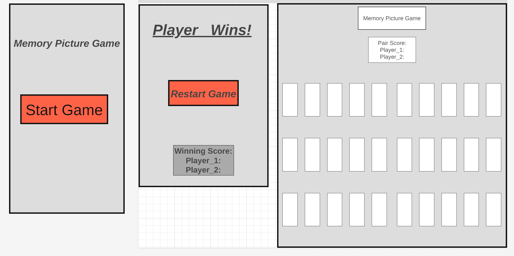

# ***Mark_u1_Project***

## ***Picture Memory Game***

###  ***Picture Memory Game***

- There will be 25 different pictures pairs opn cards.
    - Each picture will have a pair (2) and be place on cards. 
    - The cards will be randomly designated.
    - Spread across the board.

- Once the game has started and the cards have been layed out in a randomized way they will stay in that spot until they have been paired.
    - At the begging of the game the player will click 2 cards.
        - Once clicked the card will turn over.
        - The player will either find a pair or not.
        - Finding a pair will remove those cards from the board and add one to the players score, then that same player will be give another turn.
        - If no pair the next player will now beging their turn repeating the pervious steps. 
    - The paired cards will be removed from the board and the area the card was in will be left blank.
    - Each player will have 2 clicks per turn.
        - After every turn if the players do not find a pair.
        - The cards they exposed will be shown and then turned back over 5 seconds after the second clicked card.
    - When all cards have been paired another screen will pop up with the winner and a button to either end the game or restart another game. 
    - Once the game has ended it will tally the scored and keep track of how many times you lost or won.
    - You can click a button next to the tally to completely wipe the score to start over.

## ***How to get Started***

- ***Develope a design and layout.***
    - Type of cards
    - Pictures on the cards
    - How I want to cards presents

- ***Create a Wireframe***
    - Develope the layout for the following:
        - Start page
        - Game page
        - Winning / Restart page

- ***Pseudocode***
    - Start writing pseudocode
        - Begin describing the process the game will follow
        - Develop the different steps the game will follow 

# ***Credits***
#### The following sites are what I used and referenced during the process of building my Picture Memory Game.
- MrJanHorak / battleship
    - looked at how Jan Horak did his README.md and Pseudocode
    - [Github battleship](https://github.com/MrJanHorak/battleship/blob/main/pseudocode.md)
- Bro Code
    - Used this video to learn how to take user input for their name and make it appear in my score display
    - [YouTube](https://www.youtube.com/watch?v=JeXqaKeJSRI)
- Box Shadowing buttons
    -I learned how to put box shadowing around my splash screen buttons
    -[CSS](https://developer.mozilla.org/en-US/docs/Web/CSS/box-shadow)
- Splash Screen
    - Learned how to make a splash screen using this video
    - [Splash Screen](https://www.youtube.com/watch?v=MOlaldp1Fv4&t=219s)
- Splash Screen disappears
    - use this to figure out how to make startbtn get rid of splash screen to play game
    -[StartBtn](https://www.w3schools.com/howto/howto_css_login_form.asp)
- Link to second page
    - used this to learn how to click a button and change webpage
    - [Website](https://www.altcademy.com/blog/how-to-link-a-button-to-another-page-in-html/)
- 
    - 
    - 
- 
    - 
    - 
- 
    - 
    - 
- 
    - 
    - 

# ***Wireframe***
### Added wireframe file to github repository

